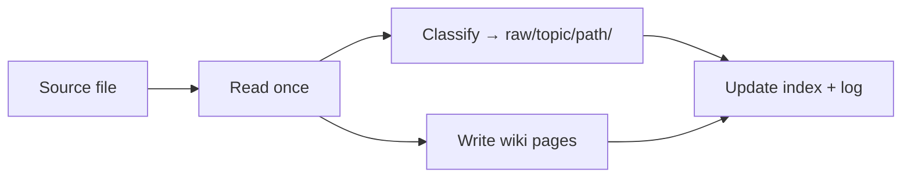
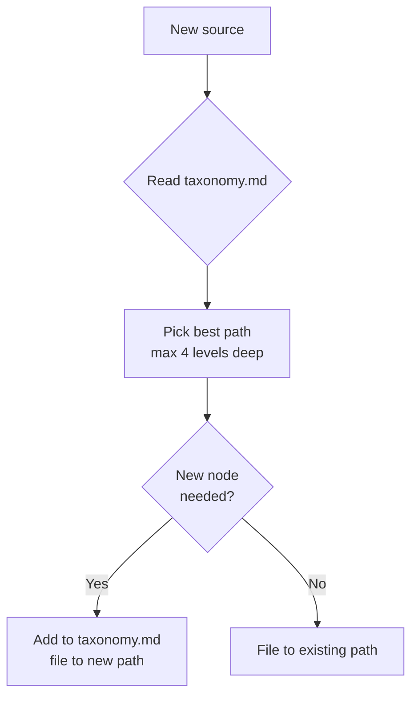
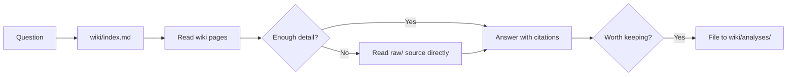
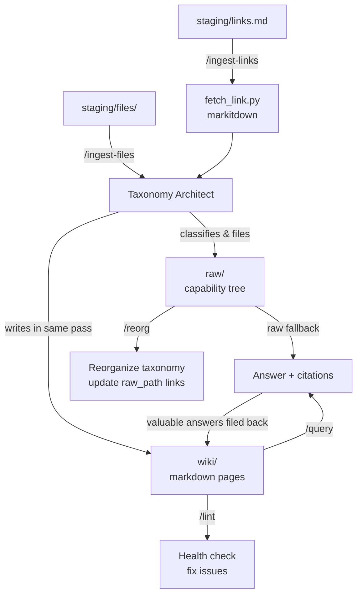

# LLM Wiki

A reusable template for building a persistent knowledge base — you supply the sources, Claude maintains the wiki.

Based on Karpathy's [LLM Wiki pattern](https://gist.github.com/karpathy/442a6bf555914893e9891c11519de94f).

---

## What is this?

Most tools make you search raw documents every time you ask a question. This is different. Claude reads each source once, extracts what matters, and weaves it into a growing wiki of interlinked pages. Every new source makes the wiki richer. Every question you ask can be filed back as a permanent page. Knowledge accumulates instead of being rediscovered from scratch.

Your role is to curate sources and ask good questions. Claude handles the summarizing, cross-referencing, filing, and consistency — all the bookkeeping that makes wikis fail over time.

This folder is a **reusable template**. Copy it to create different wikis — an AI research wiki, a personal notes wiki, a competitive analysis wiki. Only three top-level category names need to change between instances.

---

## How the wiki is organized

The wiki has three layers:

```
init/
├── staging/          ← YOUR INBOX: drop files and links here
│   ├── files/        files to process (PDF, markdown, text)
│   └── links.md      URLs to download and process (one per line)
│
├── raw/              ← SOURCE ARCHIVE: filed by topic, never edited
│   ├── taxonomy.md   the live capability tree Claude maintains
│   ├── assets/       downloaded images
│   └── llm/rag/      example: capability path (up to 4 levels deep)
│
└── wiki/             ← THE KNOWLEDGE BASE: Claude writes, you read
    ├── index.md      catalog of every page — Claude's starting point for queries
    ├── log.md        append-only history of every operation
    ├── overview.md   evolving synthesis of everything in the wiki
    ├── sources/      one summary page per source you've ingested
    ├── concepts/     technique and idea pages (RAG, Attention, etc.)
    ├── entities/     specific things: models, people, organizations
    └── analyses/     comparisons, discoveries, and filed query answers
```

### The raw/ folder — capability tree

Files in `raw/` are organized in a **business capability hierarchy** — up to 4 levels deep. Claude builds this tree dynamically as you ingest sources. You only provide the top-level categories.

Example for an AI/LLM wiki:
```
raw/
├── taxonomy.md           ← Claude keeps this map up to date
├── llm/
│   ├── rag/
│   │   ├── graph-rag/
│   │   └── hybrid-rag/
│   └── fine-tuning/
└── agents/
    ├── frameworks/
    │   ├── adk/
    │   └── langchain/
    └── memory/
```

### The wiki/ pages — five types

| Type | Folder | What it contains |
|------|--------|-----------------|
| **Source** | `sources/` | Summary, key points, and a link back to the raw file |
| **Concept** | `concepts/` | What a technique or idea is, how it works, which sources discuss it |
| **Entity** | `entities/` | A specific model, person, or organization and what the wiki knows about it |
| **Analysis** | `analyses/` | A comparison, synthesis, or answered question — filed back from a `/query` |
| **Overview** | root of wiki/ | `index.md` (catalog), `log.md` (history), `overview.md` (synthesis) |

Every page has a small header block (YAML frontmatter) with its type, tags, dates, and — for source pages — the path back to the raw file. This lets Claude navigate directly to the original when needed.

---

## Setup

### 1. Copy the template

```bash
cp -r path/to/init/ my-wiki/
cd my-wiki/
```

### 2. Set your domain (one edit, 3–5 lines)

Open `CLAUDE.md` and find the **Seed Taxonomy** section. Replace the top-level categories with your domain:

```
# Seed Taxonomy — AI/LLM Wiki   ← change the comment
llm                               ← replace these 3–5 lines
agents                            ← with your domain's root categories
infrastructure
```

That's the only edit needed. Everything under those categories grows automatically.

**Other domain examples:**
- Personal wiki: `health`, `goals`, `learning`, `relationships`
- Business wiki: `product`, `engineering`, `customers`, `operations`

### 3. Install Python tools

```bash
bash tools/setup.sh
```

This creates a local virtual environment (`tools/.venv/`) and installs two packages: `markitdown` (converts URLs and files to markdown) and `rank_bm25` (search). Runs in about 30 seconds.

### 4. Open in Claude Code

Open the wiki folder (your copy) as the project in Claude Code. The `/ingest-files`, `/ingest-links`, `/query`, `/lint`, and `/reorg` commands become available immediately.

---

## Daily use

### Adding a source — file

1. Copy or save any file into `staging/files/` (PDF, markdown, Word doc, text)
2. Run `/ingest-files` in Claude Code
3. Claude reads it, decides where it belongs in `raw/`, moves it there, and writes the wiki pages — all in one pass
4. Browse the updated pages in `wiki/`

### Adding a source — link

1. Open `staging/links.md` and paste a URL on its own line
2. Run `/ingest-links`
3. Claude downloads the page as markdown, then ingests it like a file
4. The URL is removed from `links.md` once processed

### Asking questions

```
/query What is the difference between Graph RAG and standard RAG?
```

Claude reads the relevant wiki pages and synthesizes an answer with links to the source pages. If the wiki summary isn't detailed enough, it reads the original raw file directly. If the answer is useful enough to keep, it's filed as a new page in `wiki/analyses/`.

### Keeping the wiki healthy

Run `/lint` occasionally — Claude scans for orphan pages, broken links, contradictions, concepts that need their own page, and pages that haven't been verified against new knowledge recently. Run `/reorg` when the `raw/` folder structure feels off — Claude proposes changes and waits for your approval before moving anything.

---

## Keeping knowledge current

In fast-moving fields like AI/LLM, sources from six months ago can already be partially outdated. The wiki has three mechanisms to handle this.

### When you ingest a new source

The ingest workflow automatically checks existing related pages for conflicts. If the new source updates a claim, Claude rewrites that section in-place. If it contradicts something, both positions are noted with dates. If it directly supersedes an older source, the old source page is marked `status: superseded` with a link to the new one. You don't need to do anything — this happens as part of every `/ingest-files` or `/ingest-links` run.

### Page freshness — `last_verified`

Every concept and entity page carries a `last_verified` date in its header. When `/lint` runs, it surfaces any page not reviewed in 60–90 days as a candidate for refresh. In AI/LLM, 60 days is a reasonable threshold; for slower-moving domains you can raise it.

### Targeted refresh — `/refresh <page>`

When you know a topic area has moved on, run `/refresh` against the relevant page:

```
/refresh rag
/refresh GraphRAG
```

Claude reads the page, finds all sources that contributed to it, scans `raw/` for newer files in the same topic area, and rewrites stale claims. The main body always reflects current best understanding. Anything removed from the main body moves to a `## Changelog` section at the bottom — the history is preserved, just not front and centre.

### What never gets deleted

Source pages (`wiki/sources/`) are permanent records of what a document said at a point in time. They are never rewritten or deleted — they just get a `superseded_by` link in their header when newer work replaces them. This gives you a full audit trail of how the field's thinking evolved.

---

## Skills reference

| Skill | What it does |
|-------|-------------|
| `/ingest-files` | Process all files in `staging/files/` — classify, move to `raw/`, write wiki pages, check existing pages for conflicts, clear staging |
| `/ingest-links` | Download all URLs in `staging/links.md`, then ingest like files, remove processed URLs |
| `/query <question>` | Answer from wiki; reads raw source if needed; files valuable answers back |
| `/refresh <page>` | Bring one wiki page up to date — compare against newer sources, rewrite stale claims, log what changed |
| `/lint` | Health check — fix orphans, broken links, contradictions; surface stale pages (last verified > 60–90 days) |
| `/reorg` | Propose `raw/` taxonomy cleanup; update all wiki `raw_path` links after moving files |

---

## How it works — technical overview

### Single-pass ingest

The most important efficiency principle: Claude reads each source **exactly once**. In that single read, the Taxonomy Architect decides where the file belongs in `raw/`, and the wiki writer creates the summary and entity/concept pages — all from the same in-context content. No re-reads.



### Taxonomy Architect — dynamic classification

You never manually organize `raw/`. Claude classifies every source automatically during ingest, using the current `raw/taxonomy.md` as a reference. New sub-categories are created as needed. The tree grows from your content.



### Query with raw fallback

Queries answer from the wiki first — it's faster and the summaries cover most questions well. When a question needs more depth, Claude follows the `raw_path` breadcrumb in the wiki page's frontmatter straight to the original source file.



---

## Full architecture



---

## Obsidian (optional)

The wiki is plain markdown and works in any viewer — VS Code, Typora, GitHub, etc. Claude never uses Obsidian; it reads files directly.

If you want the graph view and Dataview queries, open your wiki folder as an Obsidian vault:

- **Settings → Files & links → Attachment folder path**: `raw/assets`
- **Settings → Files & links → Default location for new notes**: `wiki/`
- Install plugins: **Dataview**, **Marp**

`[[WikiLink]]` syntax in pages renders as graph edges automatically. Dataview query to list all pages:
```dataview
TABLE type, updated, sources FROM "wiki"
SORT updated DESC
```

---

## Tips

- **Obsidian Web Clipper** (browser extension) converts articles to markdown — drag straight into `staging/files/`
- The wiki is a git repo — you get version history and branching for free
- Run `/lint` every 20–30 sources to catch drift before it compounds
- The log is machine-readable: `grep "^## \[" wiki/log.md | tail -10` shows recent activity
- Questions that produce good answers compound — use `/query` liberally and let Claude file the best ones back
